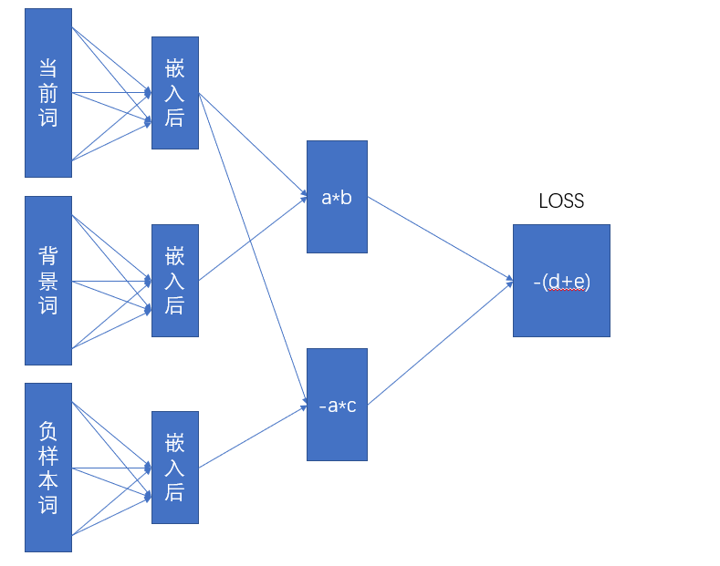

# Word2Vec
train to get Vector ，word Embedding

已用jupyter重构
直接运行`W2V.ipynb`即可在gpu上训练
https://github.com/xox9943/Word2Vec/blob/main/W2V.ipynb

It has been reconstructed with jupyter and can be trained on GPU by running directly。

训练模型结构如下

